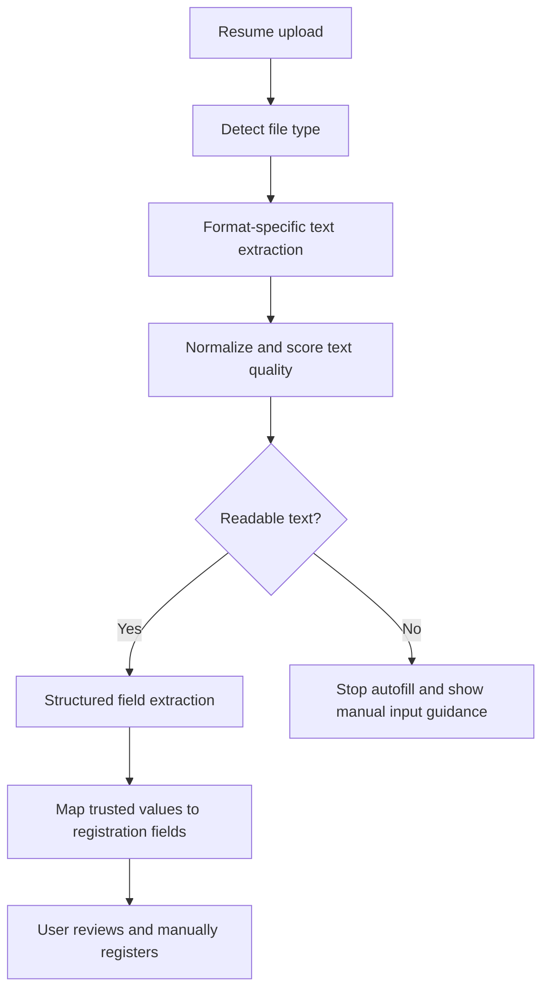

# Talent Pool Design System

> Inspiration: Toss design system  
> Product: Samsung recruiter talent pool management system  
> Status: Applied to MVP  
> Updated: 2026-06-04

---

## 1. Visual Theme & Atmosphere

This product is an internal recruiting operations console. It should feel calm, fast, and trustworthy. The visual direction is inspired by Toss: white surfaces, warm grey backgrounds, clear typography, one strong blue for interaction, and minimal shadows.

The system should not look like a marketing page. It is a work tool for repeated daily use, so density, scanning, and data confidence matter more than decoration.

Core qualities:

- Clear white workspace with warm grey page background.
- Deep charcoal text for headings and important data.
- Toss-inspired blue only for interactive states and primary actions.
- Minimal shadow and low visual noise.
- Compact cards and tables for recruiter workflows.
- Korean-first typography with Latin and numeric balance.
- Tabular numerals for metrics, counts, scores, and table data.
- No emojis in UI or documentation.

---

## 2. Color Palette & Roles

### Primary

| Token | Value | Usage |
|-------|-------|-------|
| `--blue` | `#3182f6` | Primary buttons, active navigation, links, selected controls |
| `--blue-700` | `#2272eb` | Hover and pressed states |
| `--blue-soft` | `#e8f3ff` | Weak buttons, selected surfaces, informational backgrounds |
| `--bg` | `#f9fafb` | Page background |
| `--surface` | `#ffffff` | Cards, panels, table background, sidebar |
| `--surface-soft` | `#f2f4f6` | Secondary background, tracks, subtle fills |

### Text

| Token | Value | Usage |
|-------|-------|-------|
| `--text` | `#191f28` | Primary text, headings, metrics |
| `--muted` | `#6b7684` | Body metadata, secondary descriptions |
| `--subtle` | `#8b95a1` | Captions, placeholders, quiet labels |

### Borders

| Token | Value | Usage |
|-------|-------|-------|
| `--line` | `#e5e8eb` | Default borders, dividers |
| `--line-strong` | `#d1d6db` | Focus-adjacent borders, emphasized separators |

### Semantic

| Token | Value | Usage |
|-------|-------|-------|
| `--green` | `#03b26c` | Success, completed states, verified data |
| `--amber` | `#fe9800` | Warning, pending review, low confidence fields |
| `--red` | `#f04452` | Error, failed parsing, blocking states |
| `--violet` | `#a234c7` | Special classification, AI-related metadata |

Rules:

- Use blue for interaction, not decoration.
- Use semantic colors only when the meaning is clear.
- Avoid large decorative color fields.
- Keep the page mostly white and grey.

---

## 3. Typography Rules

### Font Stack

```css
"Toss Product Sans", "Tossface", "SF Pro KR", "SF Pro Display",
-apple-system, BlinkMacSystemFont, "Basier Square",
"Apple SD Gothic Neo", Roboto, "Noto Sans KR", sans-serif;
```

### Type Scale

| Role | Size | Weight | Line Height | Usage |
|------|------|--------|-------------|-------|
| Display | 30px | 700 | 40px | Key counts and important metrics |
| Heading Large | 24px | 700 | 32px | Page titles |
| Heading | 20px | 700 | 28px | Section titles |
| Subtitle | 16px | 600 | 24px | Panel headings, navigation labels |
| Body | 14px | 400 | 22px | Table text, descriptions |
| Body Small | 13px | 400 | 20px | Metadata, secondary labels |
| Caption | 12px | 400 | 18px | Timestamps, helper text |

Rules:

- Use 700 for headings and numbers.
- Use 600 for controls and emphasized labels.
- Use 400 for body text.
- Use tabular numerals for counts, percentages, dates, and scores.
- Do not use negative letter spacing.

---

## 4. Component Stylings

### Buttons

Primary button:

- Background: `#3182f6`
- Text: `#ffffff`
- Border: none
- Radius: 12px
- Minimum height: 44px
- Font: 14px, weight 700
- Hover: `#2272eb`

Weak button:

- Background: `#e8f3ff`
- Text: `#2272eb`
- Border: none
- Radius: 12px
- Minimum height: 40px

Neutral button:

- Background: `#ffffff`
- Text: `#191f28`
- Border: `1px solid #e5e8eb`
- Radius: 12px

### Inputs

Default input:

- Background: `#ffffff`
- Border: `1px solid #e5e8eb`
- Radius: 14px
- Padding: 10px 14px
- Text: `#333d4b`
- Placeholder: `#8b95a1`
- Focus: `#3182f6` border with soft blue ring

### Cards and Panels

Recruiting operations require dense scanning, so this product uses compact card geometry while keeping Toss-inspired clarity.

- Background: `#ffffff`
- Border: `1px solid #e5e8eb`
- Radius: 8px
- Shadow: `0 2px 8px rgba(0,0,0,0.08)`
- Padding: 16px to 20px by density

### Badges

Badges use weak semantic colors by default:

- Blue weak: informational or AI search context
- Green weak: valid or completed
- Amber weak: pending review or low confidence
- Red weak: blocking, failed, or invalid data
- Violet weak: special classification

Badge geometry:

- Radius: pill
- Font: 12px, weight 700
- Height: 24px to 28px

### Tables

Tables are operational surfaces and should prioritize scanning:

- Header background: `#f2f4f6`
- Header text: `#6b7684`
- Row divider: `#e5e8eb`
- Candidate names: weight 700
- Numeric cells: tabular numerals
- Avoid dense borders around every cell.

### Tabs

Segmented tabs:

- Container: transparent
- Default: white background, grey border
- Active: `#e8f3ff` background, blue text, blue border
- Radius: 12px

### Toasts

Toast:

- Background: `#191f28`
- Text: `#ffffff`
- Radius: 8px
- Shadow: `0 4px 12px rgba(0,0,0,0.12)`
- One short sentence.
- No icon and no emoji.

---

## 5. Layout Principles

Spacing:

- Base unit: 8px
- Common values: 4, 8, 12, 16, 20, 24, 32, 40
- Page padding: 24px on desktop, 16px on mobile
- Panel gaps: 14px to 16px
- Dense table cells: 12px

Layout:

- Desktop uses a fixed left navigation and fluid workspace.
- Mobile collapses to a single-column layout.
- Dashboard metrics appear first, followed by pipeline, skill distribution, and action queue.
- Candidate detail is a single-page profile, not a tabbed view. The header places the large profile photo and candidate identity on the left, and 담당자, 사업부, 상태, 최종 업데이트, 최초 등록일 on the right. Put 주요 역량/성과, 학력, and 경력 first below the header, followed by resume attachments, basic information, activity, and applications.

Rules:

- First viewport must show actual work content.
- No landing page or marketing hero.
- Avoid nested cards.
- Use stable dimensions for buttons, filters, metrics, and rows.

---

## 6. Depth & Elevation

| Level | Treatment | Usage |
|-------|-----------|-------|
| Flat | No shadow | Page background, inline elements |
| Subtle | `0 1px 3px rgba(0,0,0,0.06)` | Small list separation |
| Standard | `0 2px 8px rgba(0,0,0,0.08)` | Cards and content panels |
| Elevated | `0 4px 12px rgba(0,0,0,0.12)` | Toasts and floating controls |

Rules:

- Do not use colored shadows.
- Do not stack multiple heavy shadows.
- Use borders before shadows when information density is high.

---

## 7. Do's and Don'ts

Do:

- Use `#3182f6` for primary actions and selected states.
- Keep most surfaces white.
- Use warm grey backgrounds to separate areas.
- Use concise Korean UI copy.
- Show AI search evidence directly inside search results, not as a primary detail-profile section.
- AI search should accept a blank-by-default natural language query and rank the pool by semantic fit, not by a prefilled example query.
- Use parsing review and audit states visibly where operationally useful, but keep quality score and parsing confidence out of candidate detail.
- Keep tables compact but readable.

Don't:

- Do not use blue as decoration.
- Do not use large gradients, decorative orbs, or ornamental backgrounds.
- Do not use emojis.
- Do not use overly large hero typography inside panels.
- Do not use purple or dark blue as the dominant theme.
- Do not hide audit or data quality state behind secondary screens.

---

## 8. Responsive Behavior

Breakpoints:

| Range | Behavior |
|-------|----------|
| `< 880px` | Sidebar becomes full-width top block, controls stack |
| `< 1180px` | Dashboard panels collapse to single column where needed |
| `>= 1180px` | Full operations layout with sidebar and multi-panel dashboard |

Rules:

- Text must not overflow controls.
- Filters stack cleanly on mobile.
- Tables may scroll horizontally inside their own container.
- Primary workflows remain reachable without a landing screen.

---

## 9. Agent Prompt Guide

Use this when extending the interface:

- Build a work-focused HR operations surface inspired by Toss clarity.
- Use white cards, warm grey backgrounds, charcoal text, and Toss-inspired blue interactions.
- Make dashboard metrics scannable with 30px tabular numerals.
- Make candidate rows dense, readable, and action-oriented.
- Show AI search evidence directly in each result.
- Keep AI search input blank by default; use natural language scoring across role, skills, education, career achievements, and years of experience.
- Make parsing review, retention, and audit state visible as badges or panels where they support the workflow.
- Keep component radius disciplined: 8px cards, 12px buttons, 14px inputs, pill badges.
- Avoid decorative imagery, gradients, emojis, and marketing composition.

---

## 10. Resume Parsing Architecture

Resume upload must not decode binary documents as plain text. PDF, DOCX, HWP, and HWPX files have document-specific internal structures, so the system should extract text through a format-aware pipeline before mapping values into the talent registration form.

Detailed technical design: `docs/02-design/features/resume-parsing.design.md`

Core flow:



Rules:

- Do not pass raw PDF, DOCX, HWP, ZIP, XML, or binary text into form fields.
- Run a text quality guard before parsing. Reject text with replacement characters, binary signatures, PDF commands, XML tags, or mojibake patterns.
- Use DOCX/HWPX ZIP XML extraction, PDF text-layer extraction, and clear failure states for scanned PDFs or unsupported HWP files.
- Keep OpenAI or any AI extraction API key on the server only. The browser should receive structured JSON, never hold secrets.
- Auto-fill only fields with enough confidence. Leave weak or missing values blank for recruiter review.
- Preserve the user's manually typed values unless they confirm overwrite.
- Education and career values must map to repeatable form rows.
- Current employment maps to `현재` and hides the end year/month input.
- Year/month value `0` is stored for unknown data but omitted from display.
- Uploading a resume never saves or registers a candidate automatically.

---

## Iconography & SVG Guidelines

- Use one icon style throughout the product.
- Prefer inline SVG icons with `currentColor`.
- Icon sizes: 16px inline, 18px button, 24px navigation.
- Do not use emoji icons.
- Do not mix multiple icon libraries.

---

## Document Policies

- No emojis in UI, labels, statuses, or documentation.
- Korean is the primary UI language.
- English may be used for short system labels and technical terms.
- All design decisions should support recruiter speed, candidate data confidence, and audit visibility.
