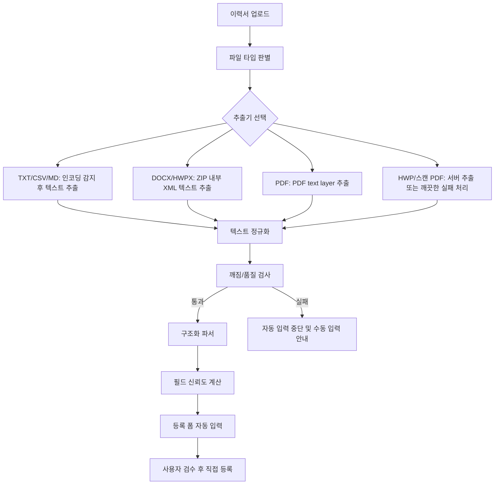

# Resume Parsing Design

> Feature: resume-parsing  
> Product: Samsung Talent Pool Console  
> Date: 2026-06-05  
> Status: Design Draft

---

## 1. Problem

현재 인재 등록 화면은 업로드된 파일을 `ArrayBuffer`로 읽은 뒤 `TextDecoder`로 바로 해석한다. 이 방식은 `.txt` 파일에는 동작할 수 있지만, PDF, DOCX, HWP처럼 내부 구조가 있는 문서 파일에서는 바이너리/압축/XML/PDF 오브젝트가 그대로 텍스트처럼 섞여 이상한 글자가 출력될 수 있다.

목표는 이력서 파일을 업로드했을 때 깨진 원문을 폼에 넣지 않고, 인재 등록에 필요한 값만 구조화해서 자동 입력하는 것이다. 최종 등록은 사용자가 실제 이력서와 비교한 뒤 직접 수행한다.

---

## 2. Design Goals

- 파일 포맷별로 올바른 텍스트 추출기를 사용한다.
- 깨진 글자, 바이너리 조각, PDF 내부 명령어, XML 태그는 등록 폼에 들어가지 않게 차단한다.
- 추출된 텍스트를 표준 후보자 초안 스키마로 변환한 뒤 입력란에 매핑한다.
- 이름, 현재/최근 회사, 직무, 핵심 기술, 학력, 경력 값을 자동 입력한다.
- 학력/경력은 여러 개를 배열로 처리하고, 등록 화면의 반복 입력 UI에 그대로 반영한다.
- 현재 재직 중인 경력은 종료 시점을 `현재`로 저장하고 종료 년/월 입력란을 숨긴다.
- 년/월 값이 `0`인 경우 화면 표시에서는 해당 년 또는 월을 생략한다.
- 파싱 실패 또는 낮은 신뢰도일 때는 잘못된 값을 채우지 않고 사용자가 수동 입력할 수 있게 안내한다.

## 3. Non-Goals

- 업로드와 동시에 후보자를 자동 등록하지 않는다.
- 스캔 이미지 PDF의 OCR을 MVP 필수 범위로 두지 않는다.
- 원본 이력서 전문을 등록 화면 하단에 다시 노출하지 않는다.
- 브라우저에 OpenAI API key나 서버 비밀키를 노출하지 않는다.

---

## 4. Target Data Model

```ts
type ResumeParseResult = {
  meta: {
    fileName: string;
    fileType: "txt" | "pdf" | "docx" | "hwpx" | "hwp" | "unknown";
    extractionMethod: string;
    textQuality: number;
    parseConfidence: number;
    warnings: string[];
  };
  candidate: {
    name: ParsedField<string>;
    company: ParsedField<string>;
    role: ParsedField<string>;
    skills: ParsedField<string[]>;
    summary: ParsedField<string>;
    education: ParsedEducation[];
    career: ParsedCareer[];
  };
};

type ParsedField<T> = {
  value: T;
  confidence: number;
  sourceText?: string;
};

type ParsedEducation = {
  degree: ParsedField<string>;
  school: ParsedField<string>;
  major: ParsedField<string>;
  start: ParsedField<string>;
  end: ParsedField<string>;
};

type ParsedCareer = {
  country: ParsedField<string>;
  company: ParsedField<string>;
  rank: ParsedField<string>;
  position: ParsedField<string>;
  start: ParsedField<string>;
  end: ParsedField<string>;
  achievements: ParsedField<string>;
};
```

Form mapping only uses `value`. `confidence` and `warnings` are used to decide whether to auto-fill or leave the field blank.

---

## 5. Architecture



---

## 6. Extraction Strategy

| 파일 유형 | 처리 방식 | 실패 조건 | UX |
|----------|-----------|-----------|----|
| `.txt`, `.md`, `.csv` | BOM 확인 후 UTF-8, EUC-KR 순서로 디코딩 | 깨짐 점수 높음, 텍스트 20자 미만 | 수동 입력 안내 |
| `.docx` | ZIP 해제 후 `word/document.xml`, `word/header*.xml`, `word/footer*.xml`에서 `w:t` 텍스트 수집 | ZIP 아님, XML 없음 | 파일 형식 확인 안내 |
| `.hwpx` | ZIP 해제 후 `Contents/*.xml` 텍스트 수집 | ZIP/XML 구조 없음 | HWPX 읽기 실패 안내 |
| `.pdf` | PDF.js 기반 page textContent 추출 | 텍스트 레이어 없음, 스캔 PDF | OCR 미지원 및 수동 입력 안내 |
| `.hwp` | 서버 사이드 HWP parser 또는 변환 서비스로 처리 | 파서 미지원/암호화 문서 | DOCX/PDF 변환 요청 |
| 이미지 | MVP에서는 OCR 제외 | 항상 자동 입력 제외 | 수동 입력 안내 |

중요 규칙:

- PDF, DOCX, HWP 파일을 `TextDecoder`로 직접 읽지 않는다.
- `PK`, `%PDF`, XML 태그, PDF stream 명령어가 폼 값에 들어오면 파싱 실패로 본다.
- 추출된 원문이 깨졌다고 판단되면 자동 입력을 중단한다.

---

## 7. Text Quality Guard

자동 입력 전에 텍스트 품질을 계산한다.

| 검사 | 기준 |
|------|------|
| replacement char rate | `�` 비율이 1% 초과면 실패 |
| control char rate | 탭/개행을 제외한 제어문자 비율이 1% 초과면 실패 |
| binary signature | `%PDF`, `PK\u0003\u0004`, `xref`, `stream`, `endobj`가 다량 남으면 실패 |
| mojibake pattern | `ì`, `ë`, `í`, `ê`, `Ã`, `Â` 반복 비율이 높으면 실패 |
| useful text length | 정규화 후 20자 미만이면 실패 |
| Korean/Latin ratio | 한글/영문/숫자/기호 외 문자가 과도하면 실패 |

실패 시:

- 기존 사용자가 입력한 값은 유지한다.
- 깨진 텍스트를 어떤 입력란에도 넣지 않는다.
- 상태 문구는 `이 파일에서 읽을 수 있는 텍스트를 충분히 추출하지 못했습니다. DOCX 또는 텍스트 PDF로 다시 업로드해주세요.`로 표시한다.

---

## 8. Structured Parsing

구조화 파서는 2단계로 동작한다.

### 8.1 Browser Deterministic Parser

정규식과 섹션 분리를 사용해 빠르게 후보 값을 찾는다.

- 이름: `이름`, `Name`, 문서 상단 단독 한글 이름 패턴
- 이메일/전화: 현재 등록 필드에는 미매핑, 향후 확장 필드로 보존 가능
- 회사: 최신 경력의 회사명 또는 `현재 회사`, `최근 회사`
- 직무: `지원 직무`, `희망직무`, `포지션`, 최신 경력의 직책
- 학력: `학력`, `Education`, 학교명/학위/전공/기간이 있는 줄
- 경력: `경력`, `Experience`, 회사명/직급/직책/기간/성과가 있는 블록
- 기술: `기술`, `Skills`, 일반 기술 키워드 목록

이 결과는 최종 폼 입력값이 아니라 서버 AI 구조화 실패 시 사용하는 fallback 및 서버 프롬프트 참고값이다.

### 8.2 Server AI Structured Extractor

정규식 결과가 부족하거나 여러 줄 블록 해석이 필요하면 서버 사이드 AI 추출기를 사용한다.

- 실행 위치: Vercel Serverless Function `/api/parse-resume`
- 입력: 추출된 텍스트, 파일명, deterministic parser 결과
- 출력: `ResumeParseResult` JSON schema
- 보안: OpenAI API key는 서버 환경변수에만 보관한다.
- 원칙: 텍스트에 없는 정보는 추측하지 않고 빈 값으로 반환한다.

### 8.3 Company Country Enrichment

직장소재국가는 이력서에 명시된 값을 최우선으로 사용한다. 이력서와 deterministic parser 결과에 국가가 없는 경력에 한해서 서버 API가 OpenAI Responses API web search 도구로 회사 소재 국가를 보강한다. 검색 결과가 불확실하면 빈 값으로 둔다.

우선순위:

1. 이력서에 명시된 국가
2. deterministic parser가 찾은 국가
3. web search로 확인한 회사 소재 국가
4. 빈 값

---

## 9. Field Mapping Rules

| Parse field | Form field | Mapping rule |
|-------------|------------|--------------|
| `candidate.name.value` | `name` | confidence >= 0.7일 때 자동 입력 |
| `candidate.company.value` | `company` | 최신 경력 회사 우선, 없으면 현재/최근 회사 라벨 |
| `candidate.role.value` | `role` | 지원 직무 라벨 우선, 없으면 최신 경력 직책 |
| `candidate.skills.value` | `skills` | 중복 제거 후 쉼표로 연결 |
| `candidate.summary.value` | `summary` | 핵심 경력 요약 또는 빈 값 |
| `education[]` | 학력 반복 입력 | degree, school, major, start, end 매핑 |
| `career[]` | 경력 반복 입력 | country, company, rank, position, start, end, achievements 매핑 |

Confidence rule:

- `>= 0.7`: 자동 입력
- `0.4 ~ 0.69`: 자동 입력하지 않고 상태 문구에 확인 필요 필드 수만 표시
- `< 0.4`: 무시

사용자가 이미 입력한 필드는 기본적으로 덮어쓰지 않는다. 이미 값이 있는 상태에서 이력서를 다시 업로드하면 `현재 입력값을 이력서 파싱값으로 덮어쓸까요?` 확인 후 적용한다.

---

## 10. Date Normalization

입력 표준은 `YYYY-MM`, `YYYY`, `0`, `현재` 네 가지를 허용한다.

| 원문 | 저장값 | 표시 |
|------|--------|------|
| `2020.03` | `2020-03` | `2020년 03월` |
| `2020` | `2020` | `2020년` |
| `0` | `0` | 표시하지 않음 |
| `2020-0` | `2020-0` | `2020년` |
| `0-03` | `0-03` | `03월` |
| `현재`, `Present`, `재직중` | `현재` | `현재` |

기간 표시는 시작/종료 둘 다 비어 있거나 `0`이면 `-`로 표시한다.

---

## 11. UI Behavior

업로드 상태:

1. `이력서를 읽는 중입니다.`
2. `문서 텍스트를 추출하는 중입니다.`
3. `이력서에서 읽은 정보를 입력했습니다. 실제 이력서와 비교 후 등록해주세요.`
4. 실패 시 `읽을 수 있는 텍스트를 충분히 추출하지 못했습니다. DOCX 또는 텍스트 PDF로 다시 업로드해주세요.`

폼 적용 원칙:

- 자동 입력은 등록 버튼을 누르지 않는다.
- 파싱된 학력/경력 배열 수만큼 반복 입력 행을 만든다.
- 현재 재직 중 경력은 체크박스를 켜고 종료 년/월 입력란을 숨긴다.
- 깨진 텍스트, XML 태그, PDF 명령어는 입력란에 표시하지 않는다.
- 하단 파싱 미리보기 영역은 만들지 않는다.

---

## 12. Test Plan

필수 fixture:

- UTF-8 TXT 이력서
- EUC-KR TXT 이력서
- DOCX 이력서
- 텍스트 PDF 이력서
- 스캔 PDF 이력서
- HWPX 이력서
- HWP 이력서
- 학력 2개 이상, 경력 3개 이상인 이력서
- 현재 재직 중 경력이 있는 이력서
- 날짜 일부가 `0`인 이력서

검증 항목:

- 깨진 문자열이 어떤 입력란에도 들어가지 않는다.
- 이름/회사/직무가 올바른 필드에 매핑된다.
- 학력/경력 반복 행 수가 파싱 결과와 일치한다.
- 현재 재직 중이면 종료 년/월 입력란이 숨겨지고 저장값은 `현재`다.
- 날짜 `0`은 화면 표시에서 생략된다.
- 스캔 PDF 또는 미지원 HWP는 깨진 값 대신 실패 안내를 보여준다.

---

## 13. Implementation Order

1. 기존 `extractReadableTextFromBytes` 직접 디코딩 방식을 제거한다.
2. 파일 타입 판별 함수 `detectResumeFileType(file, buffer)`를 만든다.
3. `extractTextFromTxt`, `extractTextFromDocx`, `extractTextFromPdf`, `extractTextFromHwpx`를 분리한다.
4. HWP binary는 서버 추출기 또는 명확한 미지원 안내로 처리한다.
5. `scoreExtractedTextQuality(text)`를 만들고 실패 시 자동 입력을 중단한다.
6. `parseResumeText`는 깨끗한 텍스트만 입력받도록 계약을 바꾼다.
7. `ResumeParseResult` 스키마 기준으로 필드 confidence를 계산한다.
8. `applyParsedResumeToRegisterForm`은 confidence 기준과 기존 입력값 보호 규칙을 적용한다.
9. Supabase Edge Function 기반 AI structured extractor를 추가한다.
10. fixture 기반 브라우저 검증과 `npm run check`를 통과시킨다.
