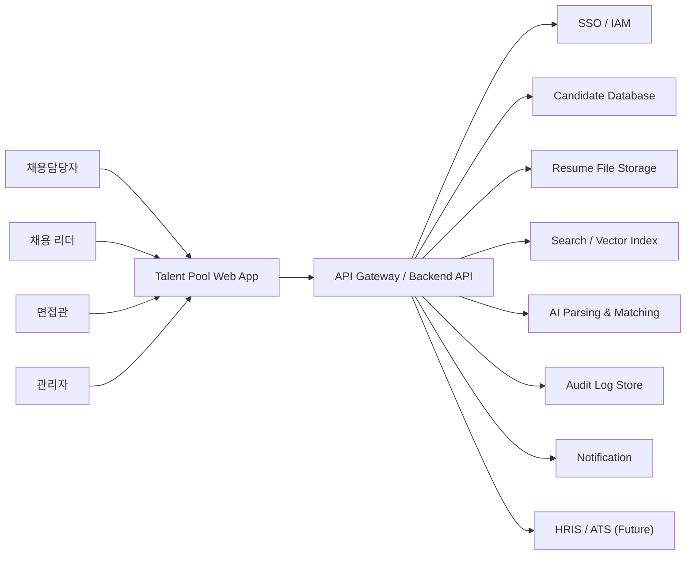
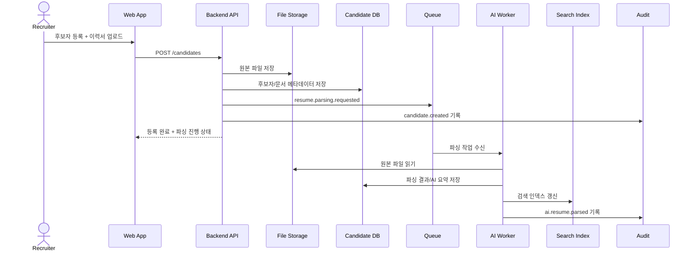
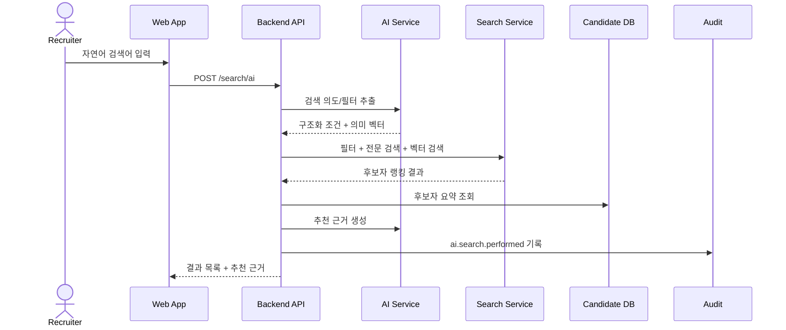
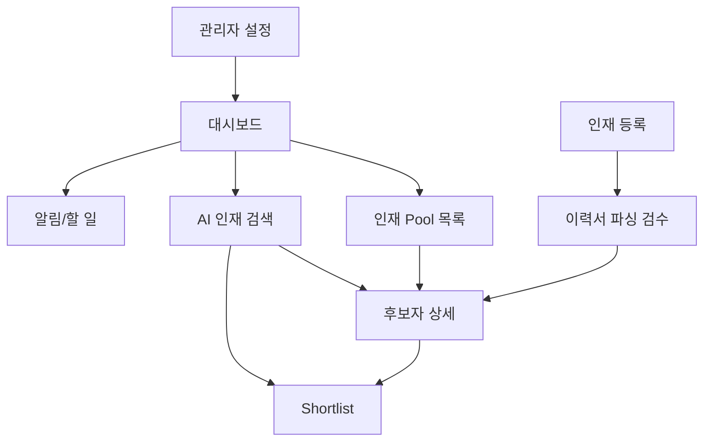
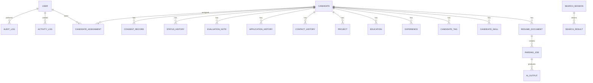
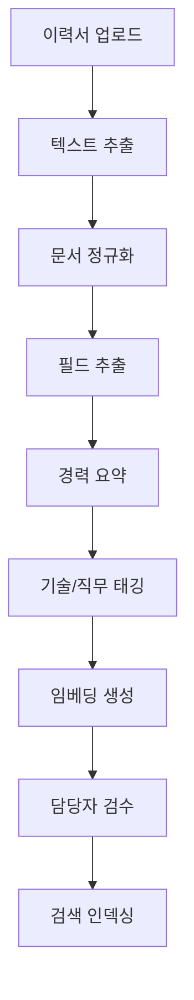

# 삼성전자 채용담당자용 인재 Pool 관리 시스템 설계서

> Version: 1.0.0  
> Date: 2026-06-04  
> Status: Design Draft  
> Feature: talent-pool-management  
> Level: Enterprise  
> Plan: docs/01-plan/features/talent-pool-management.plan.md

---

## 1. 설계 개요

### 1.1 목적

본 설계서는 삼성전자 채용담당자용 인재 Pool 관리 시스템의 MVP 및 확장 구현을 위한 기술 설계 기준을 정의한다. 기획서에서 정의한 대시보드, 인재 등록 및 이력서 파싱, AI 기반 인재 검색, 인재 프로필 상세 조회, 이력 관리, 개인정보/보안/감사 기능을 실제 시스템 구성 요소, 데이터 모델, API, AI 처리 흐름, 운영 정책으로 구체화한다.

### 1.2 설계 목표

- 후보자 데이터를 단일한 기준으로 저장하고 검색 가능한 구조로 만든다.
- 이력서 파싱과 AI 요약/태깅을 비동기 작업으로 처리해 사용자 대기 시간을 줄인다.
- 일반 필터 검색과 자연어 기반 AI 검색을 함께 지원한다.
- 후보자 상세 화면에서 기본 정보, 원본 이력서, AI 요약, 접촉 이력, 지원 이력, 평가 메모를 통합 조회한다.
- 후보자 조회, 수정, 파일 다운로드, AI 검색, 상태 변경 등 주요 행위를 감사 로그로 남긴다.
- 개인정보 동의, 보존 기간, 접근 권한, 데이터 마스킹을 기본 설계에 포함한다.
- MVP는 빠르게 구현 가능하게 유지하되, 향후 ATS/HRIS 연동과 대량 후보자 처리로 확장할 수 있게 한다.

### 1.3 주요 가정

- 사용자는 삼성전자 내부 SSO를 통해 인증된다.
- 후보자 데이터는 내부 개인정보 처리 기준에 따라 수집, 보관, 삭제된다.
- AI 모델은 사내 승인된 모델 또는 승인된 클라우드 모델을 사용한다.
- 원본 이력서 파일은 객체 스토리지에 저장하고, 메타데이터와 검색 인덱스는 별도 저장소에서 관리한다.
- MVP에서는 핵심 워크플로우를 우선 구현하고, 외부 ATS/HRIS 연동은 2차 단계에서 확장한다.

### 1.4 제약 및 트레이드오프

| 항목 | 설계 판단 |
|------|-----------|
| 서비스 구조 | MVP는 도메인별 모듈 경계를 가진 백엔드로 시작하고, AI/파싱/검색/감사 영역은 독립 워커 또는 서비스로 분리 가능하게 설계 |
| 검색 방식 | 정형 필터 검색, 전문 검색, 벡터 검색을 함께 사용해 정확도와 유연성을 균형화 |
| AI 결과 | 자동 확정하지 않고 담당자 검수 및 수정 가능 구조로 설계 |
| 개인정보 | 검색/추천 편의보다 동의 상태, 접근 권한, 감사 추적을 우선 |
| 데이터 품질 | 파싱 신뢰도와 필수 항목 완성도를 표시하고, 미확정 데이터는 추천 결과에서 낮은 가중치 적용 |

---

## 2. 시스템 아키텍처

### 2.1 시스템 컨텍스트



### 2.2 서비스 구성

| 서비스/모듈 | 책임 | MVP 필수 |
|-------------|------|----------|
| Web App | 대시보드, 후보자 목록, 등록, 상세, AI 검색, 관리자 화면 | Yes |
| API Gateway | 인증 검증, 라우팅, 공통 응답, Rate Limit, 요청 로깅 | Yes |
| Candidate Service | 후보자 기본 정보, 상태, 태그, 담당자, 상세 프로필 관리 | Yes |
| Resume Service | 파일 업로드, 원본 파일 메타데이터, 파싱 작업 요청, 검수 결과 저장 | Yes |
| AI Service | 이력서 파싱 보조, 경력 요약, 태그 추천, 자연어 검색 해석, 매칭 근거 생성 | Yes |
| Search Service | 필터 검색, 전문 검색, 벡터 검색, 결과 랭킹 | Yes |
| Activity Service | 접촉 이력, 상태 변경, 메모, 지원 이력 관리 | Yes |
| Dashboard Service | Pool 현황, 직무별 분포, 품질 지표, 전환 지표 집계 | Yes |
| Compliance Service | 동의 상태, 보존 기간, 삭제/익명화, 접근 정책 | Yes |
| Audit Service | 조회, 수정, 다운로드, 검색, AI 사용 로그 기록 | Yes |
| Notification Service | 재접촉 예정, 동의 만료, 상태 장기 미변경 알림 | Phase 2 |
| Integration Service | ATS/HRIS, 이메일, 리퍼럴, 외부 소싱 채널 연동 | Phase 2 |

### 2.3 권장 배포 구조

MVP는 다음 구성을 권장한다.

- Frontend: React 또는 Next.js 기반 Web App
- Backend: REST API 기반 애플리케이션 서버
- Worker: 이력서 파싱, AI 처리, 검색 인덱싱 비동기 작업
- Database: 관계형 DB
- Search: OpenSearch/Elasticsearch 계열 검색 엔진
- Vector Index: OpenSearch k-NN, pgvector, Milvus 등 승인된 사내 옵션
- Object Storage: 원본 이력서 및 첨부파일 저장
- Queue: Kafka, RabbitMQ, SQS 계열 메시지 큐
- Cache: Redis 계열 캐시
- Observability: 로그, 메트릭, 트레이싱 통합

### 2.4 데이터 흐름

#### 후보자 등록 및 이력서 파싱



#### AI 자연어 검색



---

## 3. 화면 설계

### 3.1 정보 구조



### 3.2 대시보드

| 영역 | 구성 |
|------|------|
| KPI Summary | 전체 후보자 수, 활성 후보자 수, 신규 등록, 최근 업데이트, 동의 만료 예정 |
| 직무/조직 분포 | 사업부, 직무군, 경력 구간, 기술 키워드별 분포 |
| 채용 단계 | 관심, 접촉 예정, 접촉 완료, 지원 유도, 전형 진행, 보류, 비활성 |
| 데이터 품질 | 파싱 미검수, 필수 항목 누락, 중복 의심, 12개월 이상 미갱신 |
| 액션 리스트 | 재접촉 예정, 동의 만료, 검수 대기, 상태 장기 미변경 후보 |

### 3.3 인재 Pool 목록

| 구성 요소 | 설명 |
|-----------|------|
| 검색 바 | 이름, 회사, 기술, 직무, 프로젝트 키워드 검색 |
| 필터 패널 | 직무, 기술, 경력, 조직, 상태, 담당자, 동의 상태, 업데이트 기간 |
| 후보자 테이블 | 이름, 최근 회사, 총 경력, 핵심 태그, 상태, 담당자, 업데이트일 |
| 배치 액션 | 담당자 배정, 태그 추가, Shortlist 추가, 상태 변경 |
| 저장된 검색 | 자주 사용하는 검색 조건 저장 및 재실행 |

### 3.4 인재 등록 및 파싱 검수

| 단계 | 화면 동작 |
|------|-----------|
| 파일 업로드 | PDF, DOCX, 변환된 HWP 파일, 포트폴리오 첨부 |
| 기본 정보 입력 | 이름, 이메일, 연락처, 출처, 동의 상태, 관심 직무 |
| 파싱 진행 | 상태 표시: 대기, 처리 중, 검수 필요, 완료, 실패 |
| 검수 화면 | 원본 이력서와 추출 필드를 좌우로 비교 |
| 확정 저장 | 담당자가 수정 후 확정하면 검색 인덱스 갱신 |

### 3.5 AI 인재 검색

| 구성 요소 | 설명 |
|-----------|------|
| 자연어 입력 | 문장형 검색 조건 입력 |
| 조건 해석 | AI가 추출한 직무, 기술, 경력, 산업, 제외 조건 표시 |
| 결과 목록 | 적합도, 핵심 근거, 상태, 동의 상태, 최근 접촉일 |
| 근거 패널 | 후보자별 매칭된 경력, 프로젝트, 기술 키워드 표시 |
| 결과 피드백 | 적합/부적합 피드백으로 검색 품질 개선 데이터 수집 |

### 3.6 후보자 상세 프로필

| 탭 | 구성 |
|----|------|
| Overview | 기본 정보, 현재/최근 회사, 경력 요약, 핵심 태그, 상태 |
| Resume | 원본 이력서 미리보기, 파싱 필드, AI 요약, 신뢰도 |
| Career | 경력, 프로젝트, 기술스택, 학력, 자격, 논문/특허 |
| Activity | 접촉 이력, 상태 변경, 담당자 변경, 재접촉 일정 |
| Applications | 과거 지원, 전형 단계, 평가 결과, 재지원 가능 여부 |
| Notes | 채용담당자 메모, 면접관 피드백, 내부 추천 의견 |
| Compliance | 동의 상태, 보존 기한, 삭제 요청, 접근 이력 요약 |

---

## 4. 데이터 모델

### 4.1 핵심 엔티티



### 4.2 후보자 도메인

#### candidates

| 필드 | 타입 | 설명 |
|------|------|------|
| id | UUID | 후보자 ID |
| full_name | string | 이름 |
| email | string | 이메일 |
| phone | string | 연락처 |
| location | string | 거주 지역 |
| current_company | string | 현재/최근 회사 |
| current_title | string | 현재/최근 직무/직급 |
| total_years_experience | decimal | 총 경력 |
| primary_job_family | string | 대표 직무군 |
| status | enum | 관심, 접촉 예정, 접촉 완료, 지원 유도, 전형 진행, 보류, 비활성 |
| source_type | enum | 직접 등록, 지원 이력, 리퍼럴, 소싱, 이벤트, 기타 |
| source_detail | string | 세부 출처 |
| consent_status | enum | 미확인, 동의, 만료 예정, 만료, 철회 |
| data_quality_score | integer | 데이터 품질 점수 |
| parsing_review_status | enum | 없음, 대기, 검수 필요, 완료, 실패 |
| created_by | UUID | 등록자 |
| created_at | datetime | 등록일 |
| updated_at | datetime | 수정일 |
| deleted_at | datetime | 논리 삭제일 |

#### candidate_profiles

| 필드 | 타입 | 설명 |
|------|------|------|
| candidate_id | UUID | 후보자 ID |
| ai_summary | text | AI 경력 요약 |
| recruiter_summary | text | 담당자 작성 요약 |
| strengths | json | 강점 목록 |
| preferred_roles | json | 관심/추천 직무 |
| preferred_locations | json | 선호 근무지 |
| availability | string | 이직 가능성 또는 접촉 가능성 |
| profile_confidence | decimal | 프로필 신뢰도 |

### 4.3 이력서 및 파싱 도메인

#### resume_documents

| 필드 | 타입 | 설명 |
|------|------|------|
| id | UUID | 문서 ID |
| candidate_id | UUID | 후보자 ID |
| file_name | string | 원본 파일명 |
| file_type | string | PDF, DOCX 등 |
| storage_uri | string | 객체 스토리지 경로 |
| file_hash | string | 중복 탐지용 해시 |
| uploaded_by | UUID | 업로드 담당자 |
| uploaded_at | datetime | 업로드일 |
| access_policy | enum | 담당자만, 팀, 제한, 관리자 |

#### parsing_jobs

| 필드 | 타입 | 설명 |
|------|------|------|
| id | UUID | 작업 ID |
| resume_document_id | UUID | 문서 ID |
| status | enum | queued, processing, review_required, completed, failed |
| parser_version | string | 파서 버전 |
| ai_model_version | string | AI 모델 버전 |
| confidence_score | decimal | 전체 신뢰도 |
| error_message | text | 실패 사유 |
| started_at | datetime | 시작 시각 |
| completed_at | datetime | 완료 시각 |

#### parsed_resume_fields

| 필드 | 타입 | 설명 |
|------|------|------|
| id | UUID | 필드 ID |
| parsing_job_id | UUID | 작업 ID |
| field_name | string | 필드명 |
| extracted_value | json | 추출값 |
| confidence_score | decimal | 필드별 신뢰도 |
| source_page | integer | 원본 페이지 |
| review_status | enum | accepted, edited, rejected, pending |
| reviewed_by | UUID | 검수자 |
| reviewed_at | datetime | 검수일 |

### 4.4 경력/역량 도메인

| 엔티티 | 주요 필드 |
|--------|-----------|
| experiences | candidate_id, company, title, department, start_date, end_date, description, industry |
| projects | candidate_id, name, role, description, technologies, start_date, end_date, impact_summary |
| educations | candidate_id, school, degree, major, start_date, end_date, graduation_status |
| skills | id, name, normalized_name, category, aliases |
| candidate_skills | candidate_id, skill_id, proficiency, years_used, evidence, source |
| tags | id, name, category, description |
| candidate_tags | candidate_id, tag_id, source, confidence_score, created_by |
| certifications | candidate_id, name, issuer, acquired_date, expires_at |
| publications | candidate_id, type, title, organization, published_at, url |

### 4.5 활동 및 채용 이력 도메인

| 엔티티 | 주요 필드 |
|--------|-----------|
| contact_history | candidate_id, channel, contacted_by, contacted_at, outcome, next_action_at, note |
| application_history | candidate_id, requisition_id, business_unit, job_family, stage, result, applied_at, closed_at |
| evaluation_notes | candidate_id, author_id, visibility, note_type, content, created_at |
| status_history | candidate_id, from_status, to_status, reason, changed_by, changed_at |
| candidate_assignments | candidate_id, owner_id, team_id, role, assigned_at |
| shortlists | id, name, owner_id, business_unit, description, created_at |
| shortlist_candidates | shortlist_id, candidate_id, added_by, match_reason, added_at |

### 4.6 개인정보 및 감사 도메인

| 엔티티 | 주요 필드 |
|--------|-----------|
| consent_records | candidate_id, consent_type, status, consented_at, expires_at, revoked_at, source |
| retention_policies | target_type, retention_months, action_on_expiry, active |
| deletion_requests | candidate_id, request_type, status, requested_at, processed_at |
| audit_logs | actor_id, action, resource_type, resource_id, purpose, ip, user_agent, created_at |
| ai_usage_logs | actor_id, action, prompt_hash, model_version, input_resource_id, output_resource_id, created_at |

### 4.7 저장소 선택

| 저장소 | 용도 | 선택 이유 |
|--------|------|-----------|
| Relational DB | 후보자, 경력, 태그, 이력, 동의, 권한 | 트랜잭션, 관계, 감사 추적에 적합 |
| Object Storage | 이력서 원본, 포트폴리오, 첨부파일 | 대용량 파일 저장 및 접근 제어 |
| Search Engine | 키워드 검색, 필터 검색, 집계 | 빠른 후보자 검색과 대시보드 집계 |
| Vector Index | 자연어 검색, 유사 후보 추천 | 의미 기반 매칭에 필요 |
| Queue | 파싱, AI 요약, 인덱싱 비동기 처리 | 대량 파일 처리와 장애 격리 |
| Redis | 세션 보조, 캐시, 임시 작업 상태 | 대시보드/검색 응답 속도 개선 |

---

## 5. API 설계

### 5.1 공통 규칙

- Base Path: `/api/v1`
- 인증: SSO 연동 후 발급된 Access Token 사용
- 응답 형식: JSON
- 페이지네이션: `page`, `size`, `sort`
- 에러 응답: `code`, `message`, `details`, `traceId`
- 주요 변경 API는 감사 로그를 자동 기록한다.

### 5.2 후보자 API

| Method | Endpoint | 설명 |
|--------|----------|------|
| GET | `/candidates` | 후보자 목록 조회 |
| POST | `/candidates` | 후보자 신규 등록 |
| GET | `/candidates/{candidateId}` | 후보자 상세 조회 |
| PATCH | `/candidates/{candidateId}` | 후보자 기본 정보 수정 |
| PATCH | `/candidates/{candidateId}/status` | 후보자 상태 변경 |
| GET | `/candidates/{candidateId}/timeline` | 후보자 통합 이력 조회 |
| POST | `/candidates/{candidateId}/tags` | 태그 추가 |
| DELETE | `/candidates/{candidateId}/tags/{tagId}` | 태그 제거 |

#### 후보자 등록 요청 예시

```json
{
  "fullName": "홍길동",
  "email": "candidate@example.com",
  "phone": "010-0000-0000",
  "sourceType": "sourcing",
  "sourceDetail": "internal referral",
  "primaryJobFamily": "semiconductor_ai",
  "consentStatus": "consented",
  "consentExpiresAt": "2027-06-04"
}
```

### 5.3 이력서 API

| Method | Endpoint | 설명 |
|--------|----------|------|
| POST | `/candidates/{candidateId}/resumes` | 이력서 업로드 |
| GET | `/candidates/{candidateId}/resumes` | 이력서 목록 조회 |
| GET | `/resumes/{resumeId}/download-url` | 권한 검증 후 다운로드 URL 발급 |
| POST | `/resumes/{resumeId}/parse` | 파싱 작업 요청 |
| GET | `/parsing-jobs/{jobId}` | 파싱 상태 조회 |
| GET | `/parsing-jobs/{jobId}/fields` | 파싱 필드 조회 |
| PATCH | `/parsing-jobs/{jobId}/fields` | 검수 결과 저장 |
| POST | `/parsing-jobs/{jobId}/confirm` | 파싱 결과 확정 |

### 5.4 검색 API

| Method | Endpoint | 설명 |
|--------|----------|------|
| GET | `/search/candidates` | 필터/키워드 기반 후보자 검색 |
| POST | `/search/ai` | 자연어 기반 AI 검색 |
| POST | `/search/similar-candidates` | 유사 후보 추천 |
| GET | `/search/saved` | 저장된 검색 조건 목록 |
| POST | `/search/saved` | 검색 조건 저장 |
| POST | `/search/results/{resultId}/feedback` | 검색 결과 피드백 |

#### AI 검색 요청 예시

```json
{
  "query": "NAND 공정 개발 경험이 있고 Python 데이터 분석 역량이 있는 3~7년차 후보자",
  "filters": {
    "consentStatus": ["consented"],
    "candidateStatusExclude": ["inactive"],
    "updatedWithinMonths": 12
  },
  "limit": 30
}
```

#### AI 검색 응답 예시

```json
{
  "interpretedConditions": {
    "skills": ["NAND", "Python", "data_analysis"],
    "experienceYears": { "min": 3, "max": 7 },
    "jobFamilies": ["semiconductor_process", "data_engineering"]
  },
  "results": [
    {
      "candidateId": "uuid",
      "matchScore": 0.87,
      "summary": "반도체 공정 데이터 분석 프로젝트 경험이 있는 5년차 엔지니어",
      "evidence": [
        "NAND 공정 개선 프로젝트 수행",
        "Python 기반 수율 데이터 분석 경험"
      ],
      "consentStatus": "consented",
      "lastContactedAt": "2026-04-12"
    }
  ]
}
```

### 5.5 활동/이력 API

| Method | Endpoint | 설명 |
|--------|----------|------|
| POST | `/candidates/{candidateId}/contacts` | 접촉 이력 등록 |
| GET | `/candidates/{candidateId}/contacts` | 접촉 이력 조회 |
| POST | `/candidates/{candidateId}/notes` | 메모 등록 |
| GET | `/candidates/{candidateId}/notes` | 메모 조회 |
| POST | `/candidates/{candidateId}/applications` | 지원 이력 등록 |
| GET | `/candidates/{candidateId}/applications` | 지원 이력 조회 |
| POST | `/shortlists` | Shortlist 생성 |
| POST | `/shortlists/{shortlistId}/candidates` | Shortlist 후보자 추가 |

### 5.6 대시보드 API

| Method | Endpoint | 설명 |
|--------|----------|------|
| GET | `/dashboard/summary` | 전체 Pool 요약 |
| GET | `/dashboard/distributions/job-family` | 직무별 후보자 분포 |
| GET | `/dashboard/distributions/skills` | 기술 키워드 분포 |
| GET | `/dashboard/status-funnel` | 상태별 후보자 현황 |
| GET | `/dashboard/data-quality` | 데이터 품질 지표 |
| GET | `/dashboard/compliance-alerts` | 동의 만료/보존 기한 알림 |

### 5.7 관리자/보안 API

| Method | Endpoint | 설명 |
|--------|----------|------|
| GET | `/admin/users` | 사용자 목록 |
| PATCH | `/admin/users/{userId}/roles` | 사용자 역할 변경 |
| GET | `/admin/audit-logs` | 감사 로그 조회 |
| GET | `/admin/ai-usage-logs` | AI 사용 로그 조회 |
| GET | `/admin/retention-policies` | 보존 정책 조회 |
| PATCH | `/admin/retention-policies/{policyId}` | 보존 정책 수정 |

---

## 6. 이벤트 설계

### 6.1 주요 이벤트

| 이벤트 | 발생 시점 | 소비자 |
|--------|-----------|--------|
| candidate.created | 후보자 신규 등록 | Search, Audit, Dashboard |
| candidate.updated | 후보자 정보 수정 | Search, Audit, Dashboard |
| candidate.status_changed | 상태 변경 | Activity, Audit, Notification |
| resume.uploaded | 이력서 업로드 | Resume Worker, Audit |
| resume.parsing_requested | 파싱 요청 | AI Worker |
| resume.parsed | 파싱 완료 | Candidate, Search, Audit |
| parsing.review_confirmed | 검수 확정 | Search, Dashboard |
| ai.search_performed | AI 검색 수행 | Audit, AI Quality |
| consent.expiring | 동의 만료 예정 | Notification, Compliance |
| retention.expired | 보존 기간 만료 | Compliance |

### 6.2 이벤트 스키마 공통 필드

```json
{
  "eventId": "uuid",
  "eventType": "candidate.created",
  "occurredAt": "2026-06-04T09:00:00+09:00",
  "actorId": "user-uuid",
  "resourceType": "candidate",
  "resourceId": "candidate-uuid",
  "traceId": "trace-id",
  "payload": {}
}
```

---

## 7. AI 설계

### 7.1 AI 처리 파이프라인



### 7.2 이력서 파싱

| 단계 | 설명 |
|------|------|
| 파일 전처리 | 파일 형식 확인, 바이러스 검사, OCR 필요 여부 판단 |
| 텍스트 추출 | PDF/DOCX에서 텍스트와 페이지 위치 추출 |
| 구조 분석 | 섹션, 표, 날짜, 회사명, 프로젝트 영역 식별 |
| 필드 추출 | 기본 정보, 경력, 학력, 기술, 자격, 프로젝트 추출 |
| 신뢰도 산정 | 필드별 추출 신뢰도와 전체 파싱 신뢰도 계산 |
| 검수 큐 등록 | 신뢰도 낮은 필드 또는 필수 항목 누락 시 검수 필요 표시 |

### 7.3 자연어 검색 처리

| 단계 | 설명 |
|------|------|
| 질의 분석 | 직무, 기술, 경력, 산업, 제외 조건 추출 |
| 정책 필터 | 동의 만료, 비활성, 접근 권한 없는 후보 제외 |
| 하이브리드 검색 | 정형 필터 + 전문 검색 + 벡터 검색 |
| 랭킹 | 기술 매칭, 경력 적합도, 최신성, 데이터 품질, 접촉 가능성 반영 |
| 근거 생성 | 후보자별 매칭된 이력서 문장, 프로젝트, 기술 태그 제공 |
| 피드백 수집 | 적합/부적합, Shortlist 추가 여부를 품질 개선에 활용 |

### 7.4 매칭 점수 기준

| 요소 | 가중치 예시 | 설명 |
|------|-------------|------|
| 직무 적합도 | 25% | 후보자의 주요 직무와 검색 직무 일치 |
| 기술 적합도 | 25% | 필수/우대 기술 매칭 |
| 경력 수준 | 15% | 요구 연차, 프로젝트 수준 |
| 산업/도메인 경험 | 15% | 반도체, AI, 임베디드, 제조 등 관련 경험 |
| 최신성 | 10% | 최근 업데이트, 최근 경력 정보 |
| 데이터 품질 | 5% | 파싱 검수 완료, 필수 항목 완성도 |
| 접촉 가능성 | 5% | 동의 상태, 최근 접촉 결과 |

### 7.5 AI 안전장치

- 성별, 나이, 출신지, 혼인 여부 등 민감 속성은 추천 기준으로 사용하지 않는다.
- 학교명, 나이 등 차별 가능성이 있는 항목은 기본 랭킹 가중치에서 제외한다.
- AI 추천 결과에는 항상 근거를 제공한다.
- AI가 생성한 요약과 태그는 담당자가 수정할 수 있다.
- AI 질의, 모델 버전, 입력 리소스, 출력 리소스는 로그로 남긴다.
- 개인정보 원문을 외부 모델로 전송할 경우 사내 승인 정책과 비식별화 기준을 적용한다.

---

## 8. 보안 및 컴플라이언스 설계

### 8.1 인증

- SSO 기반 인증을 기본으로 한다.
- OIDC 또는 SAML 연동을 지원한다.
- 관리자 및 민감 정보 접근자는 MFA를 적용한다.
- 세션 만료, 토큰 갱신, 비활성 세션 로그아웃 정책을 적용한다.

### 8.2 권한 모델

| 역할 | 권한 범위 |
|------|-----------|
| Recruiter | 담당 또는 소속 팀 후보자 조회/등록/수정, 메모, 상태 변경 |
| Recruiting Lead | 팀 후보자 전체 조회, 대시보드, 담당자 배정, 리포트 확인 |
| Interviewer | 배정된 후보자 상세 조회, 평가 메모 작성 |
| HR Admin | 전체 후보자 관리, 사용자/권한/정책 관리 |
| Compliance Admin | 동의, 보존, 삭제, 감사 로그 조회 및 처리 |

### 8.3 접근 제어

- RBAC를 기본으로 적용하고, 후보자 소유 조직, 담당자, 채용 프로젝트 단위의 ABAC 조건을 추가한다.
- 후보자 상세 조회 시 개인정보 표시 권한을 별도로 확인한다.
- 원본 이력서 다운로드는 미리보기보다 높은 권한을 요구한다.
- 면접관은 배정된 후보자와 배정 기간 내 정보만 조회할 수 있다.
- 동의 만료 또는 철회 후보자는 검색/추천 결과에서 제외한다.

### 8.4 데이터 보호

| 항목 | 정책 |
|------|------|
| 전송 구간 | TLS 적용 |
| 저장 데이터 | 개인정보, 연락처, 파일 URI, 원본 파일 암호화 |
| 마스킹 | 권한 없는 사용자는 연락처, 이메일, 생년월일, 주소 일부 마스킹 |
| 파일 접근 | 시간 제한 다운로드 URL, 접근 로그, 필요 시 워터마크 |
| 삭제 | 논리 삭제 후 정책에 따라 물리 삭제 또는 익명화 |
| 감사 | 조회, 수정, 다운로드, 검색, AI 사용, 권한 변경 기록 |

### 8.5 개인정보 보존 및 삭제

- 후보자별 동의 상태와 만료일을 필수 관리한다.
- 동의 만료 예정 후보자는 담당자에게 알림을 보낸다.
- 동의 만료 후보자는 검색/추천 대상에서 제외한다.
- 보존 기간 만료 후보자는 익명화 또는 삭제 워크플로우로 이동한다.
- 삭제 요청은 처리 상태와 처리자를 기록한다.

---

## 9. 검색 인덱스 설계

### 9.1 인덱스 문서 구조

| 필드 | 설명 |
|------|------|
| candidateId | 후보자 ID |
| searchableText | 경력, 프로젝트, 기술, 요약 통합 텍스트 |
| normalizedSkills | 정규화된 기술명 |
| jobFamilies | 직무군 |
| industries | 산업/도메인 |
| experienceYears | 총 경력 |
| status | 후보자 상태 |
| consentStatus | 동의 상태 |
| updatedAt | 최근 업데이트 |
| dataQualityScore | 데이터 품질 점수 |
| embedding | 후보자 프로필 임베딩 |

### 9.2 검색 필터 기본값

- 동의 상태가 `consented`인 후보자만 추천 대상으로 포함한다.
- 상태가 `inactive`인 후보자는 기본 제외한다.
- 접근 권한이 없는 후보자는 결과에서 제외한다.
- 데이터 품질 점수가 낮은 후보자는 결과 하단에 표시하거나 검수 필요 배지를 표시한다.

### 9.3 인덱스 갱신

- 후보자 생성/수정 시 부분 인덱스 갱신
- 파싱 검수 확정 시 전체 프로필 인덱스 갱신
- 동의 만료/철회 시 검색 대상 플래그 즉시 갱신
- 야간 배치로 데이터 품질 점수와 최신성 점수 재계산

---

## 10. 대시보드 집계 설계

### 10.1 주요 지표

| 지표 | 계산 기준 |
|------|-----------|
| 전체 후보자 수 | 삭제되지 않은 후보자 |
| 활성 후보자 수 | 상태가 비활성이 아니고 동의가 유효한 후보자 |
| 신규 등록 | 기간 내 created_at 기준 |
| 최근 업데이트 | 기간 내 updated_at 기준 |
| 직무별 분포 | primary_job_family 및 태그 기준 |
| 기술 분포 | candidate_skills 기준 상위 N개 |
| 데이터 품질 | 필수 정보 완성도, 파싱 검수 상태, 중복 의심 |
| 동의 만료 예정 | expires_at이 기준 기간 이내 |
| 채용 전환율 | Pool 등록 후 지원/면접/오퍼/입사 단계 전환 |

### 10.2 집계 방식

- 실시간성이 필요한 요약 지표는 캐시를 사용한다.
- 대량 집계는 배치 또는 스트림 기반으로 Materialized View를 갱신한다.
- 대시보드 조회 권한에 따라 팀/조직 범위를 제한한다.

---

## 11. 성능 및 확장성

### 11.1 성능 목표

| 기능 | 목표 |
|------|------|
| 후보자 목록 조회 | 2초 이내 |
| 후보자 상세 조회 | 2초 이내 |
| 일반 필터 검색 | 2초 이내 |
| AI 검색 1차 결과 | 5초 이내 |
| 이력서 업로드 응답 | 3초 이내 |
| 파싱 완료 | 일반 이력서 기준 1분 이내 |
| 대시보드 로딩 | 3초 이내 |

### 11.2 확장 전략

- 이력서 파싱과 AI 요약은 비동기 큐로 처리한다.
- 검색과 벡터 인덱스는 후보자 수 증가에 따라 샤딩/복제한다.
- 파일 저장소는 원본 파일과 썸네일/텍스트 추출본을 분리한다.
- 대시보드 집계는 캐시 및 배치 집계를 적용한다.
- AI Worker는 작업량에 따라 수평 확장한다.

### 11.3 캐싱 전략

| 대상 | 캐시 정책 |
|------|-----------|
| 대시보드 요약 | 5~15분 TTL |
| 코드/태그 사전 | 장기 캐시, 변경 시 무효화 |
| 후보자 상세 일부 | 권한별 캐시 주의, 민감 정보 제외 |
| 검색 조건 해석 | 동일 검색어 단기 캐시 가능 |

---

## 12. 관측성 및 운영

### 12.1 로그

- API 요청 로그
- 인증/권한 실패 로그
- 후보자 데이터 변경 로그
- 파일 업로드/다운로드 로그
- AI 작업 로그
- 검색 질의 및 결과 품질 로그
- 배치/워커 처리 로그

### 12.2 메트릭

| 영역 | 메트릭 |
|------|--------|
| API | 요청 수, 오류율, 응답 시간, 권한 실패 |
| Search | 검색 응답 시간, 결과 수, 클릭률, Shortlist 전환율 |
| AI | 파싱 성공률, 평균 처리 시간, 신뢰도, 모델 오류율 |
| Data Quality | 필수 필드 누락률, 중복 의심률, 검수 대기 건수 |
| Compliance | 동의 만료 예정, 삭제 요청 처리 시간, 감사 로그 누락 |

### 12.3 알림

- AI 파싱 실패율 급증
- 검색 응답 시간 임계치 초과
- 감사 로그 기록 실패
- 동의 만료 후보 급증
- 파일 저장소 접근 오류
- 권한 실패 또는 다운로드 이상 패턴

---

## 13. 배포 및 운영 전략

### 13.1 환경

| 환경 | 용도 |
|------|------|
| local | 개발자 로컬 개발 |
| dev | 기능 개발 통합 |
| staging | QA, 보안 점검, 파일럿 준비 |
| production | 실제 운영 |

### 13.2 CI/CD

- 코드 정적 분석 및 린트
- 단위 테스트
- API 계약 테스트
- 보안 스캔
- 컨테이너 이미지 빌드
- Staging 배포
- 승인 후 Production 배포
- Feature Flag 기반 점진적 활성화

### 13.3 롤백

- API 및 Web App은 이전 이미지로 즉시 롤백 가능해야 한다.
- DB 마이그레이션은 되돌릴 수 있는 변경과 되돌릴 수 없는 변경을 구분한다.
- 검색 인덱스는 새 인덱스를 만든 뒤 alias 전환 방식으로 배포한다.
- AI 모델 버전은 요청/결과 로그에 기록하고 이전 버전으로 전환 가능하게 한다.

---

## 14. 테스트 계획

### 14.1 단위 테스트

- 후보자 상태 전이 규칙
- 개인정보 마스킹 규칙
- 권한 정책 판단
- 데이터 품질 점수 계산
- 검색 조건 파서
- 동의 만료/보존 기간 계산

### 14.2 통합 테스트

- 후보자 등록 후 이력서 업로드
- 파싱 작업 생성 및 결과 저장
- 파싱 검수 확정 후 검색 인덱스 갱신
- AI 검색 후 결과 및 감사 로그 기록
- 상태 변경 후 타임라인 반영
- 파일 다운로드 권한 검증

### 14.3 E2E 테스트

- 채용담당자가 후보자를 등록하고 파싱 결과를 확정한다.
- AI 검색으로 후보자를 찾고 Shortlist에 추가한다.
- 후보자 상세에서 접촉 이력과 메모를 남긴다.
- 채용 리더가 대시보드에서 Pool 현황을 확인한다.
- Compliance Admin이 동의 만료 후보와 감사 로그를 확인한다.

### 14.4 성능 테스트

- 후보자 10만 명 기준 목록/검색 응답 시간 측정
- 이력서 1,000건 동시 업로드 및 파싱 큐 처리량 측정
- AI 검색 동시 요청 처리 성능 측정
- 대시보드 집계 캐시 부하 테스트

### 14.5 보안 테스트

- 권한 없는 후보자 상세 조회 차단
- 원본 이력서 다운로드 권한 검증
- 개인정보 마스킹 적용 확인
- 동의 만료 후보 검색 제외 확인
- 감사 로그 누락 여부 확인
- AI 입력 데이터 비식별화 정책 확인

---

## 15. 구현 계획

### 15.1 Phase 1: MVP 기반 구축

- 프로젝트 구조 및 공통 인증/권한 프레임워크
- 후보자 CRUD
- 후보자 목록/상세 화면
- 이력서 업로드 및 파일 저장
- 파싱 작업 상태 관리
- 기본 필터 검색
- 접촉 이력, 메모, 상태 변경
- 기본 감사 로그

### 15.2 Phase 2: AI 및 검색 고도화

- 이력서 텍스트 추출 및 필드 파싱
- AI 경력 요약 및 태그 추천
- 파싱 결과 검수 화면
- 자연어 AI 검색
- 검색 결과 근거 표시
- 검색 피드백 수집
- 검색 인덱스/벡터 인덱스 운영

### 15.3 Phase 3: 대시보드 및 컴플라이언스

- 대시보드 핵심 지표
- 데이터 품질 지표
- 동의 만료 및 보존 기간 관리
- 감사 로그 관리자 화면
- 개인정보 마스킹 고도화
- 알림/할 일

### 15.4 Phase 4: 확장 연동

- 대량 업로드
- Shortlist 공유
- ATS/HRIS 연동
- 유사 후보 추천
- 채용 캠페인 관리
- 운영 리포트

---

## 16. 리스크 및 대응

| 리스크 | 영향 | 대응 |
|--------|------|------|
| 이력서 파싱 품질 불안정 | 검색 품질 저하 | 신뢰도 표시, 검수 단계, 파서 버전 관리 |
| AI 추천 근거 부족 | 사용자 신뢰 하락 | 추천 근거 필수 제공, 원문 근거 링크 |
| 개인정보 정책 미흡 | 법무/보안 리스크 | 동의/보존/삭제/감사 기능을 MVP 필수 범위에 포함 |
| 검색 인덱스와 DB 불일치 | 잘못된 후보자 노출 | 이벤트 재처리, 인덱스 재빌드, 동기화 모니터링 |
| 권한 설계 복잡도 증가 | 개발 지연 | RBAC부터 시작하고 ABAC 조건을 단계적으로 추가 |
| 대량 파일 처리 부하 | 시스템 지연 | 큐 기반 워커, Rate Limit, 작업 우선순위 적용 |
| 사용자 도입 저항 | 활용률 저하 | 등록/검색/상세 조회의 핵심 흐름을 단순화하고 파일럿 피드백 반영 |

---

## 17. 설계 산출물 체크리스트

- [x] 시스템 컨텍스트 정의
- [x] 서비스/모듈 경계 정의
- [x] 주요 화면 구조 정의
- [x] 후보자 중심 데이터 모델 정의
- [x] 이력서 파싱 및 AI 검색 흐름 정의
- [x] API 초안 정의
- [x] 이벤트 스키마 정의
- [x] 권한/보안/컴플라이언스 설계
- [x] 검색 인덱스 설계
- [x] 대시보드 집계 설계
- [x] 테스트 계획 정의
- [x] 구현 단계 정의

---

## 18. 다음 단계

1. MVP 구현을 위한 프로젝트 기술 스택을 확정한다.
2. 화면별 와이어프레임 또는 UI 프로토타입을 작성한다.
3. 데이터베이스 스키마와 API 계약을 구현 가능한 형태로 상세화한다.
4. 이력서 파싱 및 AI 검색 PoC 범위를 정한다.
5. Phase 1 구현을 시작한다.
